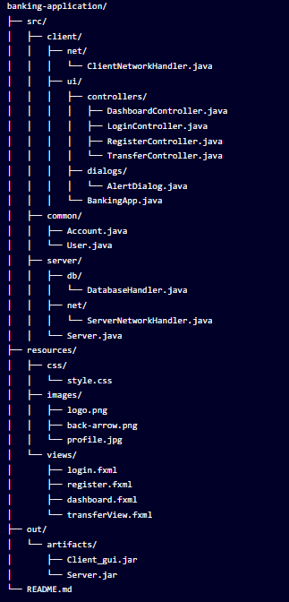

# Banking Application
## Overview
This is a modern banking application that allows users to manage their accounts through a graphical user interface. The application is built using Java and JavaFX, following a client-server architecture that supports multiple concurrent users. The server component runs on OrangePi hardware, providing a lightweight and energy-efficient backend solution.

Banking App Screenshot

## Features
* User Authentication System
* Secure login and registration
* Password protection and validation
## Account Management
* View account balance
## Financial Operations
* Deposit funds
* Withdraw funds
* Transfer money between accounts
## Modern UI/UX
* Clean and responsive design
* Custom dialog boxes for better user experience
* Dark theme with high contrast elements
# Technical Details
## Architecture
The application follows a client-server architecture:

* Client: JavaFX application that provides the user interface
* Server: Backend service running on OrangePi hardware that handles requests, manages data, and ensures transaction integrity
## Technologies Used
* Programming Language: Java
* UI Framework: JavaFX
* Database: SQLite (embedded database)
* Build System: IntelliJ IDEA with Artifact configurations
* Server Hardware: OrangePi single-board computer
## OrangePi Server
* The server component runs on an OrangePi single-board computer, which offers:

* Energy-efficient operation
* 24/7 availability with minimal power consumption
* ARM-based architecture optimized for server applications
* Compact form factor

## Design Patterns
* MVC Pattern: Clear separation between models (Account, User), views (FXML files), and controllers
* Singleton Pattern: For network handler connections
* Factory Pattern: For dialog creation
# Installation and Setup
## Prerequisites
* Java Development Kit (JDK) 11 or higher
* JavaFX SDK 17.0.2 or compatible version
* OrangePi board (for server deployment)
* Network connection between client machines and OrangePi server
## Server Setup (OrangePi)
* Install Java on OrangePi
* Install SQLite on OrangeePi


### 1. Install Java on OrangePi    
```bash
sudo apt update
sudo apt install openjdk-11-jdk
```

### 2.Transfer Server.jar to OrangePi
```bash    
scp Server.jar orangepi@<orangepi-ip-address>:/home/orangepi/
```


### 3. Run the server on OrangePi    
```bash
java -jar Server.jar
```

### 4. Set up server to run at startup (optional)
##### Create a systemd service file:
```bash
sudo nano /etc/systemd/system/banking-server.service
```
##### Add the following content

```ini    
[Unit]
Description=Banking Application Server
After=network.target

[Service]
Type=simple
User=orangepi
WorkingDirectory=/home/orangepi
ExecStart=/usr/bin/java -jar /home/orangepi/Server.jar
Restart=on-failure

[Install]
WantedBy=multi-user.target
```

Enable and start the service:
```bash
sudo systemctl enable banking-server.service
sudo systemctl start banking-server.service
```

## Client Setup
### 1. Clone the repository


```bash
git clone https://github.com/BaranParmak/BankingProject.git
cd BankingProject
```
### 2.Download JavaFX SDK

* Download from Gluon's website
* Extract to a location on your machine (e.g., C:\javafx-sdk-17.0.2)
### 3. Configure your IDE (IntelliJ IDEA)

* Open the project in IntelliJ IDEA
* Go to File > Project Structure > Libraries
* Add the JavaFX SDK as a library (path to the lib folder)
### 4. Update server connection information

* Modify ClientNetworkHandler.java to point to your OrangePi's IP address
* Default port is 8888 (adjust if needed)
### 5. Building the Application

Build > Build Artifacts > Select client_gui.jar > Build
## Running the Client Application
### 1. Create a batch file named run_client.bat with:


```plaintext  
@echo off
java --module-path "C:\javafx-sdk-17.0.2\lib" --add-modules javafx.controls,javafx.fxml -jar Client_gui.jar
```

Adjust the JavaFX SDK path according to your installation location.

### 2. Run multiple clients for testing multithreading

* Execute the batch file multiple times to open several client instances
* Log in with different accounts to test concurrent operations
* All clients will connect to the OrangePi server
## Usage Guide
### Registration
* Launch the application
* Click "Register" on the login screen
* Fill in username, password, and full name
* Submit the form
### Login
* Enter your username and password
* Click "Login"
### Dashboard Functions
* View Balance: Shows your current account balance
* Deposit: Add funds to your account
* Withdraw: Remove funds from your account
* Transfer: Send money to another account
### Money Transfer
* Enter the recipient's account number
* Enter the amount to transfer
* Confirm the transaction
## Project Structure


## OrangePi Server Monitoring
To monitor the server status on OrangePi:


```bash     
systemctl status banking-server.service
```
 
To view server logs:

```bash 
journalctl -u banking-server.service
```
### License
This project is licensed under the MIT License

### Contributors
* Baran Parmak
* Mehmet Kaş
### Acknowledgements
* JavaFX community
* Oracle for Java
* OrangePi community
* All contributors who have helped with this project
